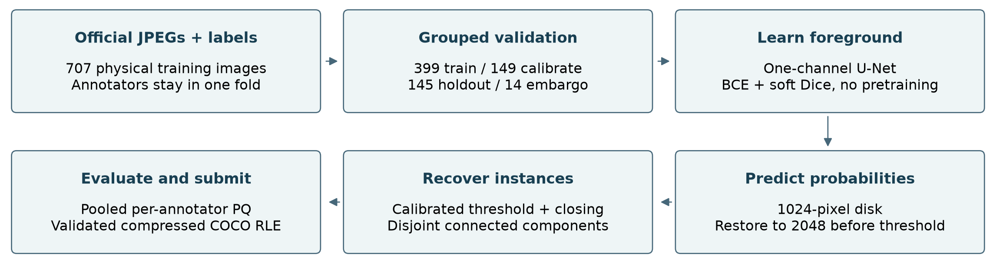

# Solar filament segmentation

[](https://github.com/srivatsav-kannan/solar-seg/actions/workflows/tests.yml)
[](requirements.txt)
[](LICENSE)

A reproducible entry for the [Solar Filament Segmentation Challenge 2026](https://www.kaggle.com/competitions/filament-segmentation-2026). Given a grayscale H-alpha solar image, identify **each individual filament and its complete shape**. The main metric is Panoptic Quality (PQ), which penalizes missed objects, spurious detections, fragmentation, and incorrect merges.

This repository contains the actual data audit, training/inference code, literature review, validation protocol, and submission checks. The compact U-Net is a measured development baseline. Stronger instance models and native-resolution refinement remain experiments; no top placement is claimed.



## Start here

| Read or run | Purpose |
|---|---|
| [Canonical notebook](notebooks/canonical.ipynb) | Explained workflow from official inputs to a validated submission |
| [Public Kaggle notebook](https://www.kaggle.com/code/srivatsavkannan/solar-filaments-canonical-baseline-2026) | Competition-associated, executable copy of the canonical workflow |
| [Model and evidence release](https://github.com/srivatsav-kannan/solar-seg/releases/tag/baseline-v0.1) | Checkpoint, configuration, report, validation, and SHA-256 checksums |
| [Competition requirements](docs/competition.md) | Rules, dates, input/output contract, host clarifications, final-entry obligations |
| [Literature review](docs/literature-review.md) | Solar-specific papers and related instance/topology methods; evidence and limitations |
| [Validation and gates](docs/validation.md) | Grouped splits, metric fidelity, holdout discipline, release criteria |
| [Experiment ledger](docs/experiments.md) | Measured results, configuration changes, failures, and next experiments |
| [Development report](output/pdf/baseline-report.pdf) | Four rendered pages in the organizer's template; final contact/form details pending |
| [Code walkthrough](docs/understanding.md) | What each component does and how to explain the method |
| [Agent instructions](AGENTS.md) | Rules for future automated or human changes |

## Measured baseline

The latest candidate uses **batch Dice plus 3,000 additional training updates**. A prospectively frozen three-fold comparison improved pooled PQ from **0.33531 to 0.35236**, with gains in every fold and a paired temporal-bootstrap gain interval of **[0.01181, 0.02230]**. This is subsequent-development validation on a previously explored corpus, with shared inner calibration; it is not a new untouched test set. The all-707-image refit has no independent internal holdout. Submission **56055334** completed with **public PQ 0.31**, improving the previous best of 0.30. Fresh local CPU inference and notebook replay produced exactly the same 1,513-instance CSV across all 180 test images.

[Latest executable notebook](notebooks/batch_dice.ipynb) · [Kaggle copy](https://www.kaggle.com/code/srivatsavkannan/solar-filaments-batch-dice-2026) · [Checkpoint and reproduction assets](https://github.com/srivatsav-kannan/solar-seg/releases/tag/batch-dice-v0.3) · [Paired validation](reports/batch-dice-cv-comparison.json) · [Submission receipt](reports/batch-dice-submission-record.json).

The next matched context experiment and tiled-inference screen failed their improvement gates; neither was submitted. [Results](reports/context-screen-03.json), [tile screen](reports/batch-dice-tiled-screen-03.json). The latest public Kaggle notebook completed with only one boundary-pixel difference across 1,513 instances relative to the submitted CSV; see [cross-platform comparison](reports/batch-dice-cloud-reproduction.json).

The frozen candidate is a width-24 U-Net with four-flip probability averaging. It uses no external weights or labels.

| Measurement | PQ |
|---|---:|
| Classical baseline, calibration | 0.08265 |
| Compact U-Net, calibration | 0.27503 |
| Larger U-Net, calibration | 0.32211 |
| Native-resolution U-Net + tiles, exploratory calibration | 0.29370 |
| Selected model + four flips, calibration | **0.33137** |
| Selected model, protected holdout | **0.34625** |
| Kaggle public leaderboard, submission 56050854 | **0.30** |
| All-data refit, submission 56053503 | **0.30** |

The second submission refit the same recipe on all 707 approved training images and **did not improve the public score**. Its own fresh local and Kaggle notebook runs reproduced the submitted CSV exactly. The original holdout result does not apply to these refit weights. [Second submission receipt](reports/full-refit-submission-record.json), [refit notebook](notebooks/full_refit.ipynb), [refit artifacts](https://github.com/srivatsav-kannan/solar-seg/releases/tag/full-refit-v0.2).

The holdout's physical-image bootstrap 95% interval is **[0.32877, 0.36327]**. Calibration was used for tuning; its maximum is optimistically biased. The candidate was frozen before holdout inspection. Kaggle returned `COMPLETE` for the first submission on 6 September 2026. Independent local CPU inference and a fresh-kernel notebook replay produced the same CSV: 1,645 instances across 180 processed observations, including two zero-detection images. The public score is an initial baseline; the leading displayed score was 0.56 when checked. [Full ledger](docs/experiments.md), [server receipt](reports/submission-record.json).

The public Kaggle notebook **version 3 completed successfully** on Linux CPU. It independently processed all 180 images and reproduced the submitted CSV **byte for byte**, including the coverage sidecar. Inference plus serialization took 44 minutes 51 seconds, excluding environment installation and the earlier audit cells. Source, checkpoint, output, and environment evidence are saved in [cloud reproduction](reports/cloud-reproduction.json). This run reproduced inference; it did not retrain the model.

The split is **399 training / 149 calibration / 145 holdout / 14 embargoed physical images**. We group 27-day blocks, keep all annotators of an observation together, audit exact duplicates, and apply a three-day embargo to training observations. Remaining long-range temporal dependence is a limitation. The official pooled, per-annotator PQ implementation is checked numerically against the organizer notebook.

The later native-resolution screen failed the improvement gate and was rejected without another holdout evaluation or submission. The [next campaign](docs/next-campaign.md) combines context and local detail, with frozen nested-CV manifests and instance-aware alternatives. Those nested-CV models remain to be trained.

## Install and reproduce

Use Python 3.12. The primary requirements pin utilized packages; `requirements-lock-macos.txt` captures the complete local development environment and includes platform-specific packages. Use the primary requirements on Linux/Kaggle.

```bash
git clone https://github.com/srivatsav-kannan/solar-seg.git
cd solar-seg
python3.12 -m venv .venv
source .venv/bin/activate
python -m pip install -r requirements.txt
python -m pip install --no-deps -e .
```

Accept the competition rules in your Kaggle account and configure the official Kaggle CLI authentication. Keep credentials outside this repository. Existing CLI authentication works without a browser in the training/submission workflow.

```bash
python scripts/download_data.py
python -m solarseg audit
python scripts/reproduce.py --data data/raw --output artifacts/reproduced
```

The reproduction script downloads the [released checkpoint](https://github.com/srivatsav-kannan/solar-seg/releases/download/baseline-v0.1/model.pt), verifies its SHA-256 and the input/split fingerprints, runs CPU inference on every test image, and validates `artifacts/reproduced/submission.csv`. Anonymous checkpoint download has been checked against the recorded hash. Platform differences may change a few floating-point boundary decisions; exact cross-architecture bitwise reproduction is not assumed.

The [canonical notebook](notebooks/canonical.ipynb) runs the same modules. Its default is audit + released-model inference. Set `RUN_TRAINING=True` to execute the recorded training recipe; set `RUN_HOLDOUT=True` only for an explicitly labeled reproduction of the already-exposed holdout. Notebook inference replay does not imply training was rerun.

On Kaggle, the notebook installs the pinned environment into a temporary virtual environment and sends each `%%solarseg` cell to one fresh, persistent kernel. This avoids upgrading NumPy inside Kaggle's already-running kernel. Cell outputs still appear in the notebook. Locally, the magic executes in your installed kernel. The CPU PyTorch build uses the same pinned base version and records its platform suffix in the run evidence. [Notebook execution details](docs/notebook-runtime.md).

The PDF's editable LaTeX is in `reports/source/`. It was built with TeX Live 2024 and `acmart` 2.03; these system dependencies are separate from the Python requirements. The report preserves the host's fixed subtitle, abstract opening, introduction paragraph, and acknowledgment.

## Train a new experiment

```bash
python -m solarseg train --run artifacts/my-run --steps 3000 --width 16 --crop 256
python -m solarseg calibrate --run artifacts/my-run --checkpoint artifacts/my-run/model.pt
```

Select on calibration and write a frozen candidate record **before** opening holdout. The `evaluate` command refuses to overwrite a completed holdout result. After the baseline holdout is exposed, use a prospectively specified evaluation protocol for subsequent selection claims.

```bash
python -m solarseg evaluate --run artifacts/my-run --checkpoint artifacts/my-run/model.pt
python -m solarseg predict --run artifacts/my-run --checkpoint artifacts/my-run/model.pt --device cpu
```

`--tile 256` enables overlapping tile inference; `--tta` averages four flips. Both are model-selection choices and require calibration. Use a new run directory when changing inference or reconstruction; cached predictions are bound to checkpoint, input, and implementation fingerprints.

## Submission gates

1. Audit official data and permitted label provenance.
2. Pass metric, grouping, mask serialization, and ownership tests.
3. Improve calibration, then freeze the candidate and inspect its protected holdout and morphology.
4. Replay the canonical notebook in a fresh kernel and validate all 180 test outputs.
5. Bind the evidence to the exact CSV hash, check quota, submit via the Kaggle SDK, and verify server scoring.

```bash
python -m pip install -r requirements-dev.txt
python scripts/quality_checks.py
python scripts/replay_notebook.py
python scripts/submit.py --run artifacts/unet-v2-tta --check-only
# Remove --check-only only for the intended, fully gated submission.
```

The notebook replay command uses a `solarseg` Jupyter kernel. Register it with `python -m ipykernel install --user --name solarseg`. Local validation includes official evaluator parity and real-data split checks; public CI skips those two checks unless their local inputs are present. Five submissions/day and two final selections are platform limits. A recorded uncertain upload is investigated before any retry.

## Inputs, outputs, and licensing

The official bundle has 707 physical training images, 1,154 annotator-image records, 8,199 polygons, and 180 test images. **Do not download the full public MAGFiLO annotation archive:** it contains competition test labels. Dates/sites are used for split diagnostics, never as prediction features. No external pretrained weights are used.

Output is a two-column CSV: `filament_id,segmentation_rle`. Each row is one nonempty, disjoint instance at **2048 × 2048**. Counts use compressed COCO RLE, and IDs preserve the original image stem. Zero detections appear in the coverage sidecar, with no dummy mask rows.

Original code is MIT licensed. Competition data, GONG-derived example figures, the host's report-template material, and external publications retain their original terms. Raw images, training annotations, credentials, and model binaries are excluded from Git history. Checkpoints are distributed as checksummed release assets for reproduction of this competition entry.

## Final-entry obligations

The displayed deadline is **15 November 2026, 06:00 UTC / 11:30 IST**. Recheck the official page before close. A scored CSV is only part of the entry: the hosts require a public Git repository, exact requirements, a complete notebook, reproducible artifacts, a report in their template, and a separate Google form. The template permits four pages of main content, excluding Acknowledgment and References. Keep source public through the actual winner announcement; the Important Dates and Prizes pages differ between 30 November and the December conference, as recorded in the requirements register.

The final form requires Google authentication through the available HTTP route. Its exact fields and successful submission receipt remain pending. Contact details, final candidate selection, and the final report must be accurate before that step. See the [requirements register](docs/competition.md) for the full audit and source links.
