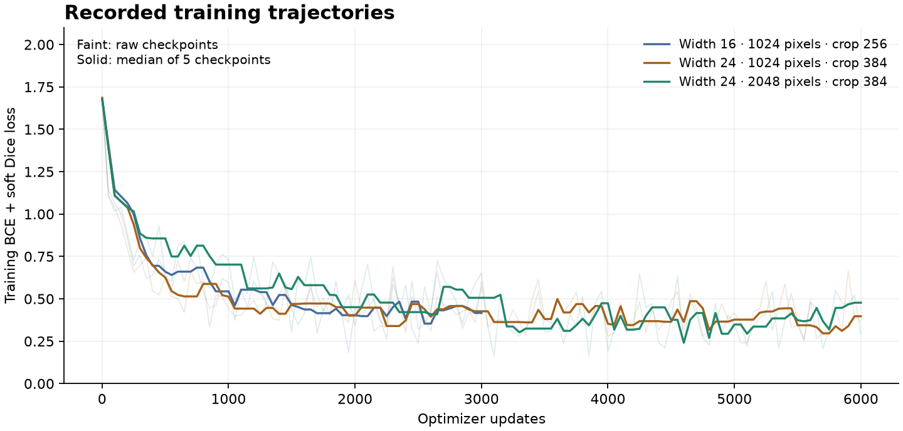

# Experiment ledger

Research began on 6 September 2026. All numbers below are measured on our split; calibration scores are used for tuning and are optimistic. No external weights or labels are used.

| Run | Training | Calibration PQ | Status |
|---|---|---:|---|
| classical-v1 | Local-background intensity deficit, no learning | 0.08265 | Reference; 16 postprocessing settings |
| unet-v1 | Width 16, 1024-pixel disk, 256 crops, batch 6, 3,000 updates | 0.25096 | Initial 16-point search |
| unet-v1 / expanded | Same checkpoint; nine larger-area settings added | 0.27503 | Threshold 0.60, area 800 native pixels, closing radius 3 |
| unet-v1-tiled | Same v1 checkpoint; 256-pixel overlapping tiles | 0.28775 | 25-setting grid; improves on v1 full-frame |
| unet-v2 | Width 24, 384 crops, 6,000 updates; otherwise same protocol | 0.32211 | Full-frame inference; 25-setting grid |
| unet-v2-tta | Same v2 checkpoint; four-flip probability averaging | **0.33137** | **Selected**; threshold 0.60, area 400, closing radius 3 |

The expanded search responds to excess false positives and fragments in calibration. It is documented adaptive tuning, not a new independent validation set. The maximum cannot be interpreted as an unbiased estimate of generalization.

Candidate selection was written to `configs/selected.json` before opening holdout results. The selected candidate scored **0.34625 holdout PQ**, with physical-image bootstrap 95% interval **[0.32877, 0.36327]**, SQ 0.66031, and RQ 0.52437. Counts: TP 952, FP 1,065, FN 662 across annotator-image comparisons; 144 fragmented-GT and 29 merged-prediction relationships under the positive-overlap diagnostic. No model or threshold was changed after inspecting this result. The holdout is now exposed; later campaigns must not present reuse as a fresh independent evaluation.

The TTA calibration gain over v2 full-frame was +0.00926 PQ, clearing the declared +0.005 promotion threshold. Width/context/update budget were changed together in v2, so this is a configuration comparison, not an isolated architectural ablation. Calibration maxima remain optimistically biased.

A subsequent uncertainty sensitivity check resampled all 27 original holdout time/duplicate groups, retaining their physical images and annotators together. With 5,000 draws and seed 2026, the 95% block-bootstrap interval is **[0.32166, 0.36834]**, wider than the physical-image interval. This reuses the frozen counts without new inference or model selection. It still cannot remove dependence between structures recurring across time blocks. See `reports/temporal-bootstrap.json` and `scripts/block_bootstrap.py`.

Size-stratified holdout recall is 50.85% for masks below 1,000 pixels (706 annotated comparisons), 66.70% for 1,000–10,000 pixels (871), and 32.43% for at least 10,000 pixels (37). The large-mask estimate has a small sample and is consistent with the truncation/fragmentation visible in the gallery. This strengthens the priority of context and instance reconstruction; small-object filtering is not the only bottleneck.

Holdout inference used MPS. The actual submission and independent notebook replay use CPU. Three deterministic calibration examples showed maximum CPU/MPS probability differences below 0.000045 and identical instance counts. This is a limited compatibility check, not a claim of bitwise equivalence on every image or on Linux. See `reports/cpu-mps-compatibility.json`.

The selected 400-pixel minimum prediction area also imposes a precise small-object limit: a ground-truth mask of at most 200 pixels cannot have IoU strictly above 0.5 with any retained prediction. There are 66 such instances among the 8,199 supplied training annotations. This is a known cost of the calibrated baseline, not a scientific definition of a filament. Future component classification or instance-aware models should test retaining genuine small objects while controlling false detections.

These are training-loss trajectories, with a five-checkpoint rolling median over the recorded raw values. Crop geometry and targets differ across runs, so the curves diagnose optimization and do not rank generalization. Calibration PQ determines candidate screening.

## Rejected native-resolution screen

After the baseline holdout was exposed, `configs/native-screen.json` prespecified one exploratory calibration-only comparison. The same width-24 model, 384-pixel crops, batch size six, seed 2026, and 6,000 updates were trained on native 2048-pixel inputs. Training took 1071.7 seconds, excluding cache preparation. The physical crop context is half that of the 1024-pixel baseline.

| Native inference | Calibration PQ | Selected postprocessing |
|---|---:|---|
| Full image | 0.28188 | Threshold 0.80, area 800, closing 3 |
| 384-pixel overlapping tiles | 0.29370 | Threshold 0.60, area 800, closing 3 |

Both used the same 25-setting reconstruction grid. The better native variant is 0.03767 below the selected baseline's calibration PQ and is rejected. No new holdout evaluation, test inference, or competition submission was performed for this model. This result supports prioritizing context together with detail; it does not show that native resolution is inherently inferior. The next campaign's nested manifests are prepared, but its models have not been trained. See `reports/native-screen.json` for the frozen plan and measured results.

## Reproduction and provenance

The first competition upload is **submission 56050854**, submitted through the Kaggle SDK on 6 September 2026. Kaggle returned `COMPLETE`, no scoring error, and **public PQ 0.30**. The downloaded leaderboard snapshot at 08:51 UTC listed this entry 320th of 521, with a displayed leading score of 0.56. Scores are rounded by the platform; this is a time-stamped development result, not a final rank or a competitive success claim. See `reports/submission-record.json` and `reports/leaderboard-snapshot.json`.

The independent local CPU command and first fresh-kernel canonical replay both processed all 180 test images and produced the exact same CSV SHA-256: `4d42e1f7b652801baed85f7513071b98343a8ef5630346934c87dbf2b3f6b1bf`. There are 1,645 instances, 178 images with predictions, and two with no predictions. Kaggle acceptance verifies that this actual zero-row case was handled successfully. The notebook inference took 642.6 seconds while another CPU inference job ran concurrently; that timing is not an isolated machine benchmark.

The first local notebook finished before its independent reference CSV. Its wrapper initially failed only at the final comparison because that reference file did not yet exist. After the reference finished, `--record-only` verified the complete executed notebook's cell sources, execution counts, absence of errors, and equal CSV hash. `reports/submission-replay-v1.json` preserves this pre-submission evidence. No missing inference was represented as completed.

The first public Kaggle notebook run failed on a live-kernel NumPy/SciPy version mismatch. The updated notebook isolates its pinned runtime; this changes execution setup, not the selected model, reconstruction parameters, or submitted CSV. See [notebook runtime](notebook-runtime.md) for the failure and reproduction procedure.

Public Kaggle notebook **version 3 completed on 6 September 2026**. A fresh Linux x86-64 CPU run generated predictions for all 180 test images in 2,690.9 seconds including serialization/validation, excluding installation and earlier audit cells. Its CSV hash is exactly the original submitted hash above; the downloaded coverage and validation records also match. The runtime was Python 3.12.13 with PyTorch 2.14.0+cpu. The checkpoint and all core source/requirements hashes match the selected release. This is measured cross-platform inference reproduction, not retraining or a guarantee for all future environments. No duplicate leaderboard submission was made. See `reports/cloud-notebook-proof.json` and `reports/cloud-reproduction.json`.

- Split: 399 optimization / 149 calibration / 145 holdout / 14 embargoed physical images. Seed 2026.
- Split SHA-256: `ebec49b919b111f0591f1740cc10a470c127371203e7522c683c9ec5a34283b8`.
- Label SHA-256: `5da9e92b5a1a1947fd5d57adb6688269625c48ec1ef884daf2a01618c9ed54a1`.
- Local hardware: Apple Silicon, 24 GB unified memory, PyTorch MPS. Runtime is measured after cache preparation and excludes downloads.
- Run directories contain config, loss history, checkpoint/hash, prediction caches, calibration results, and later evaluation/submission records. The baseline training source snapshot was captured retrospectively, before changing the implementation; this is not a claim of a launch-time Git commit.
- An earlier width-16 process was interrupted before its final checkpoint; it was discarded and the 3,000-update experiment was rerun from scratch. No partial checkpoint was scored.
- A pandas timestamp-unit defect was corrected before successful training. Regression tests now verify the three-day embargo and a nonempty optimization split.

## Next experiments

### Batch Dice and additional training: third submission

The combined loss-and-budget change adds 3,000 updates at learning rate 0.0002 to each corresponding 6,000-update baseline, using BCE plus batch Dice. It is not an isolated loss ablation. Original calibration PQ improved from 0.33137 to 0.34439. False positives fell from 1,286 to 1,193; fragmented-GT relationships fell from 178 to 159, while merged-prediction relationships rose from 29 to 32. Matched small/medium/large annotations changed from 408/614/5 to 398/637/6, with denominators 748/1,013/23. Large-filament recovery remains poor. These counts compare each supplied annotator separately. See [calibration error evidence](../reports/batch-dice-calibration-errors.json).

The prospectively frozen bounded comparison in `configs/batch-dice-cv-02.json` used outer folds 2, 3, and 4 of `configs/scoring-cv-02/index.json`, with an embargoed inner calibration partition for each fit. Each candidate initialized its own fold-specific baseline; parameters were frozen before outer inference. Baseline/candidate outer PQ was 0.34908/0.35991, 0.33782/0.36465, and 0.32117/0.33353. Pooled PQ improved **0.33531 → 0.35236**, gain **0.01705**, paired time-group bootstrap interval **[0.01181, 0.02230]**. Worst paired morphology regressions were reviewed without further tuning. This is a bounded three-fold comparison, not completion of the full five-by-three nested plan. Earlier corpus exposure, shared inner calibration, and CUDA/MPS training differences limit inference. [Frozen fits](../reports/batch-dice-cv-frozen.json), [comparison](../reports/batch-dice-cv-comparison.json), [morphology review](../reports/batch-dice-cv-morphology.json).

The frozen all-data recipe trained on all 707 approved observations, initializing the corresponding all-data baseline. Its checkpoint has no independent internal holdout score. All six submission gates passed; independent CPU inference and a fresh generated-notebook replay produced exactly the same CSV SHA-256 `9ae19115b1da6a997e3b494e714c631bba17acb711efc76c391cd61e7ffe4ec3`: 1,513 instances, 180 processed images, 178 nonempty and two empty. Submission **56055334** was uploaded on 6 September 2026; scoring is pending. The separate public Kaggle CPU notebook run is still running. [Gate evidence](../reports/batch-dice-gates.json), [fresh replay](../reports/batch-dice-replay.json), [server receipt](../reports/batch-dice-submission-record.json), [release](https://github.com/srivatsav-kannan/solar-seg/releases/tag/batch-dice-v0.3).

The full-frame/tile/context/TTA comparison and first protected holdout evaluation are complete. CPU replay, server scoring, and final-entry packaging are tracked in the release evidence.

Further campaigns should prioritize native detail, boundary/affinity supervision, detector-plus-refiner instance models, and complementary ensembles. These are research plans, not implemented results. See [the literature review](literature-review.md) for evidence and limitations and [the next campaign protocol](next-campaign.md) for a concrete order and decision budget.
